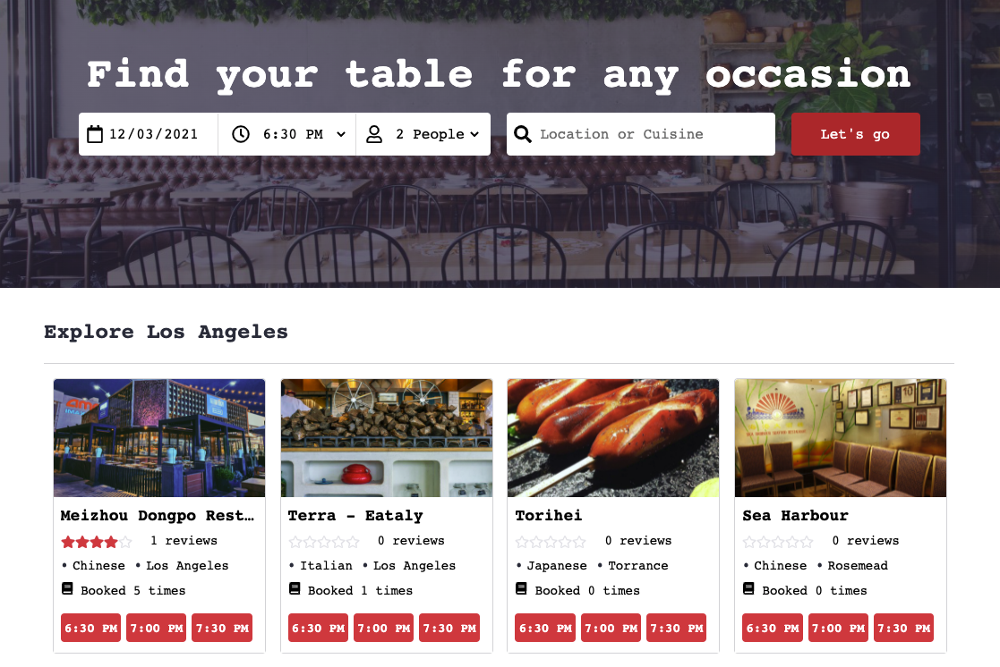
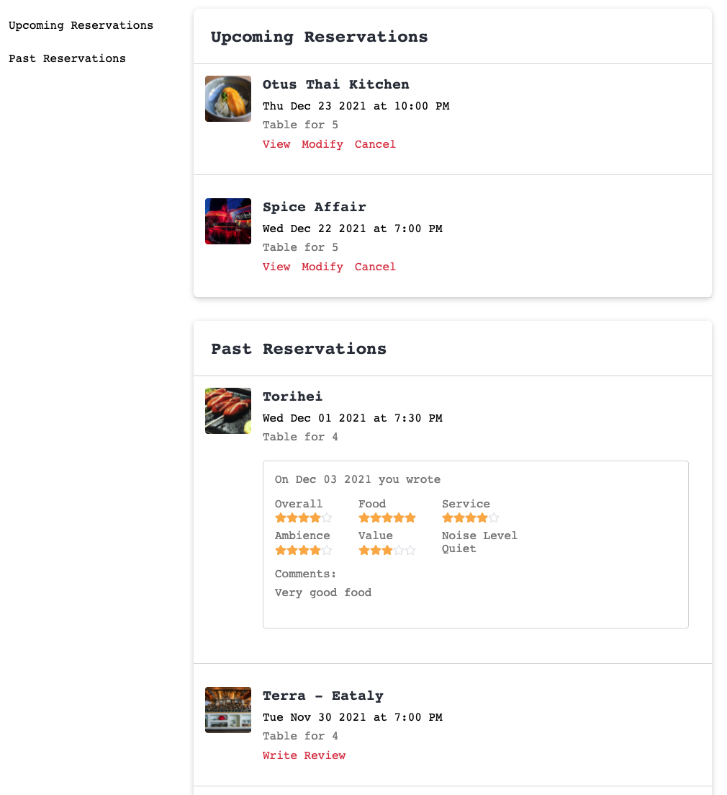
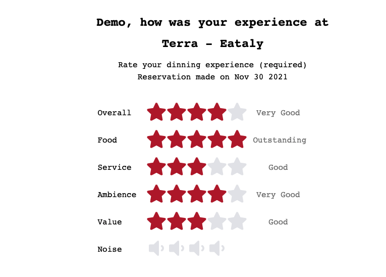

# TableLog


## [Live Site](https://tablelog.herokuapp.com/)

Welcome to TableLog, an inspiration from OpenTable, is a web-based restaurant-reservation application that allows users to search restaurants, make and manage online reservations, add and read restaurant reviews.

# Technologies
* Ruby on Rails
* PostgresSQL
* React
* Redux
* Javascript
* Google Maps API
* AWS S#

# Key Features

## Ability to view restaurants and timeslots
* User can view restaurants and available timeslots
* Signed-in user can select desired timeslots to make reservations



## Ability to view reservation history and edit reservations
* Signed-in user can navigate to profile page where the abilities of viewing, modifing, and cancelling upcoming reservations as well as creating reviews to past dining experience are provided.




## Ability to review past dining experience
* Signed-in user can add reviews to past dining experience in user's profile page and the review will be updated in restaurant show page.
* Review form provides an interactive experience for user to select ratings in several categories. Below code snippets 



```javascript
  // review_form.jsx
  // this code will provide the above dynamic rating system

  displayRatingStars(field){
      const levels = ["Poor", "Fair", "Good", "Very Good", "Outstanding"];

      return (
        <div className="rating-star-container">
          <div className="rating-stars">
            {[...Array(5)].map((star, i) => {
              const rating = i + 1

              return (
                <label key={i} >
                  <input
                    type="radio"
                    name={field}
                    value={rating}
                    onClick={this.handleSelect(field)}
                  />
                  <FaStar
                    className="star"
                    color={((i + 1) <= (this.state[`hover${field}`] || this.state[field])) ?"#b8222d" : "#e4e5e9"}
                    size={40}
                    onMouseEnter={() => this.setHover(`hover${field}`, rating)}
                    onMouseLeave={()=>this.resetHover([`hover${field}`])}
                  />
                </label>
              )
            })}

            <div className="rating-prompts">
              {levels[this.state[`hover${field}`] - 1] || levels[this.state[field] - 1]}
            </div>
          </div>
        </div>
      )
    }
```