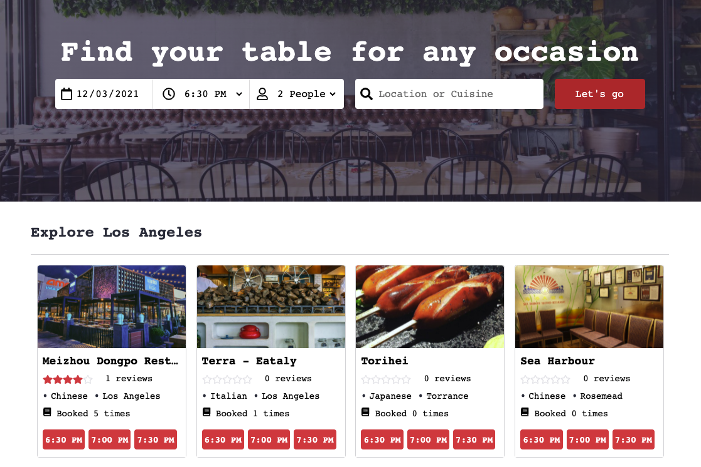

# TableLog


## [Live Site](https://tablelog.herokuapp.com/)

Welcome to TableLog, an inspiration from OpenTable, is a web-based restaurant-reservation application that allows users to search restaurants, make and manage online reservations, add and read restaurant reviews.

# Technologies
* Ruby on Rails
* PostgresSQL
* React
* Redux
* Javascript
* Google Maps API
* AWS S#

# Key Features

* User can view restaurants and available timeslots
* Signed-in user can make reservations and view upcoming reservations and reservation history from profile page with links to edit and cancel future reservations.
* Signed-in user can add reviews to past reserved restaurants.
* Reservation search parameters persist through pages navigations

## View restaurants and search timeslots


## Ability to view reservation history and edit reservations and add reviews


## Search parameters persist through navigation of the app

```javascript

```