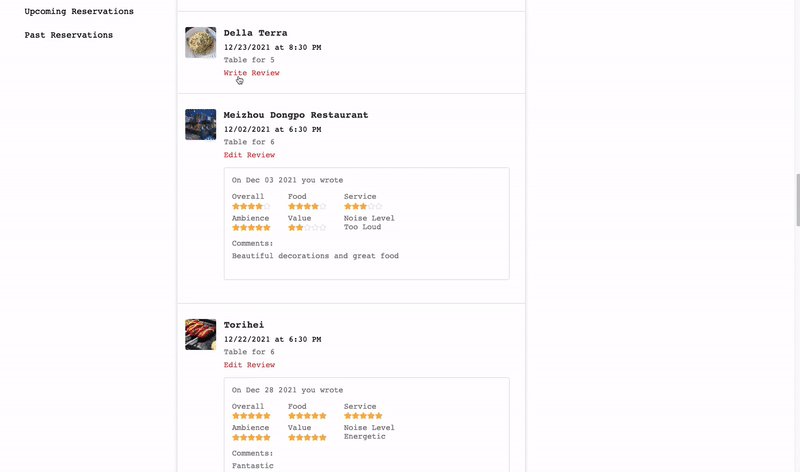

# TableLog


## [Live Site](https://tablelog.herokuapp.com/)

Welcome to TableLog, an inspiration from OpenTable, is a web-based restaurant-reservation application that allows users to search restaurants, make and manage online reservations, add and read restaurant reviews.

# Technologies
* Ruby on Rails
* PostgresSQL
* React
* Redux
* Javascript
* Google Maps API
* AWS S#

# Key Features

## Ability to view restaurants and timeslots
* User can view restaurants and available timeslots
* Signed-in user can select desired timeslots to make reservations


## Ability to search restaurants via cuisine type or city location
* User can user the search box to search restaurants via cuisine type or city


```javascript
  // search_box.jsx
  // this code provides the dynamic search result suggestion

    const filteredCuisines = cuisines.filter(cuisine => cuisine.toLowerCase().includes(this.state.query))
    const filteredCities = cities.filter(city => city.toLowerCase().includes(this.state.query))

    const cuisineList = (filteredCuisines.length === 0) ? null :
      (<div>
        <div className="search-suggestions-title">
          <FaUtensils className="search-fa-utensils" size={18} />
          Cuisines
        </div>
        {filteredCuisines.map((cuisine, i) => (
          <div className="search-suggestions-list" key={i}>
            <Link to={`/search/${cuisine}`}>{cuisine}</Link>
          </div>
        ))}
      </div>)

    const cityList = (filteredCities.length === 0 ) ? null : 
      (<div>
        <div className="search-suggestions-title">
          <FaLocationArrow className="search-fa-location" size={18} />
          Cities
        </div>
        {filteredCities.map((city,i)=>(
          <div className="search-suggestions-list" key={i}>
            <Link to={`/search/${city}`}>{city}</Link>
          </div>
        ))}
      </div>)

    const searchSuggestions = (!this.state.searching || this.state.query === "") ? null :
      (<div className="search-suggestions">
          <div className="search-suggestions-query">
            <Link id="search-suggestions-query" to={`/search/${this.state.query}`}>Search: "{this.state.query}"</Link>
          </div>
          {cuisineList}
          {cityList}
        </div>)
```


## Ability to view reservation history and edit reservations
* Signed-in user can navigate to profile page where the abilities of viewing, modifing, and cancelling upcoming reservations as well as creating reviews to past dining experience are provided.


## Ability to review past dining experience
* Signed-in user can add new reviews or edit existing reviews to past dining experience in user's profile page and the review will be updated in restaurant show page.
* Review form provides an interactive experience for user to select ratings in several categories. Below code snippets 

